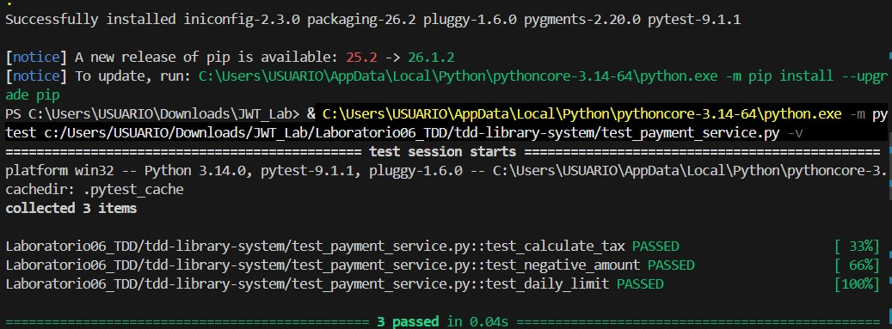

# Sistema de Gestión de Biblioteca - TDD Básicos

Este proyecto consiste en la implementación de un sistema básico automatizado utilizando la metodología **Desarrollo Guiado por Pruebas (Test Driven Development - TDD)** y el framework `pytest`.

## 🚀 Metodología TDD Aplicada

El desarrollo se realizó siguiendo el ciclo estricto de TDD:
1. **Fase Roja (Red):** Diseño previo de pruebas unitarias (fallo controlado).
2. **Fase Verde (Green):** Implementación de la lógica justa para la aprobación de los test.
3. **Refactorización (Refactor):** Estructuración del código bajo buenas prácticas.

## 📋 Reglas de Negocio Validadas

* **Cálculo de Totales con Impuestos (18%):** Se aplica la tasa correspondiente de forma automatizada.
* **Validación de Parámetros Inválidos:** Control de excepciones ante montos menores a cero.
* **Límite Operativo Diario:** Restricción de transacciones que excedan el límite de 10,000.

## 📊 Resultados de las Pruebas

Aquí se muestra la ejecución exitosa de los test unitarios en el entorno local:



## 🛠️ Instalación y Ejecución

```bash
# 1. Instalar pytest
pip install pytest

# 2. Ejecutar las pruebas
python -m pytest test_payment_service.py -v